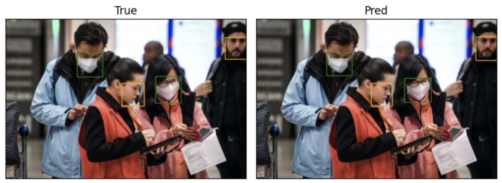
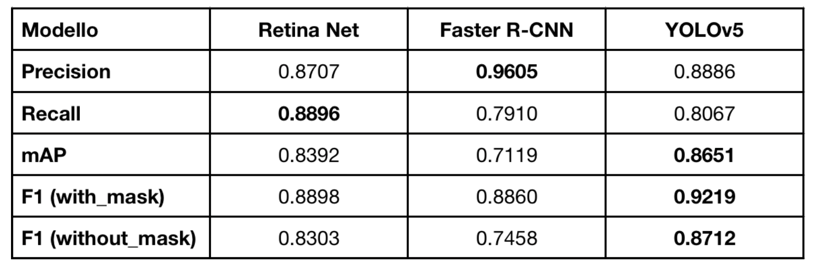

# Face Mask Detection

This project implements **Face Mask Detection** using three deep learning models: **RetinaNet**, **YOLOv5**, and **Faster R-CNN**. The aim is to compare the accuracy, speed, and overall performance of each model in detecting and classifying face masks in images. The models were trained and tested on a custom dataset specifically prepared for this task, with performance metrics and insights thoroughly evaluated.

## Project Overview

- **Objective**: Detect and classify face masks (correctly worn, not worn, incorrectly worn) in images.
- **Models Used**: RetinaNet, YOLOv5, Faster R-CNN.
- **Dataset**: Face Mask Detection Dataset, consisting of 890 images with bounding box annotations for three classes: `with_mask`, `without_mask`, and `mask_weared_incorrect`.

## Table of Contents

- [Dataset](#dataset)
- [Models and Training](#models-and-training)
- [Evaluation Metrics](#evaluation-metrics)
- [Results](#results)
- [Conclusion](#conclusion)

## Dataset

The dataset used is the **Face Mask Detection Dataset** from Kaggle, containing 890 images with bounding boxes labeled in three categories:
- `with_mask`
- `without_mask`
- `mask_weared_incorrect`

To improve the training results, the `mask_weared_incorrect` class was removed due to insufficient examples, which caused challenges in learning and overfitting issues.

Dataset split:
- **Training set**: 56%
- **Validation set**: 24%
- **Test set**: 20%

## Models and Training

Three models were implemented and compared in this project:

1. **RetinaNet**:
   - Architecture includes a backbone (ResNet-50-FPN) for feature extraction and a RetinaHead module for classification and localization.
   - Focal Loss function used to handle class imbalance.
   
2. **YOLOv5**:
   - YOLOv5s variant with CSP-Darknet53 backbone.
   - Utilizes anchor boxes and feature maps to detect objects in real-time.
   
3. **Faster R-CNN**:
   - Multi-stage model with ResNet-50-FPN backbone and Region Proposal Network (RPN).
   - ROI Pooling Layer for fixed-size feature extraction, suitable for high precision.

Each model was trained for 200 epochs. The models were fine-tuned using pre-trained weights on COCO, and various data augmentation techniques were applied to improve generalization.

## Evaluation Metrics

Each model’s performance was evaluated using these metrics:

- **Loss** (calculated on training and validation sets)
- **Precision**: Proportion of true positive predictions.
- **Recall**: Proportion of true positives among actual positives.
- **F1 Score**: Harmonic mean of Precision and Recall.
- **Average Precision (AP)**: Area under the precision-recall curve for each class.
- **Mean Average Precision (mAP)**: Average of APs across all classes.
- **Confusion Matrix**: To analyze classification performance across classes.

## Results

The following example demonstrates how the bounding boxes work to predict face masks on an image:

Comparative analysis on the performance of the three models yielded the following insights:
- **YOLOv5** had the best mAP score, making it suitable for real-time applications due to its single-stage architecture.
- **RetinaNet** showed strong classification ability with minimal overfitting.
- **Faster R-CNN** provided high precision but with lower recall, likely due to the multi-stage detection pipeline.

The table below presents the results of each model across various evaluation metrics:

The confusion matrix revealed class imbalances, especially in the `without_mask` class, impacting recall. YOLO’s mAP advantage was evident despite its single-stage approach, affirming its applicability for scenarios prioritizing speed over extreme precision.

## Conclusion

The **Face Mask Detection** project successfully demonstrated the use of deep learning for object detection in a healthcare application. The comparison highlights trade-offs in accuracy, speed, and resource requirements, providing insights into model selection for practical applications. Future work could involve expanding the dataset, adding data augmentation, and tuning hyperparameters for enhanced model performance.

## Authors

- **Alessandro Magnani** - [alessandromagnani17](https://github.com/alessandromagnani17)
- **Andrea Matteucci** - [AndreaMatteucci](https://github.com/AndreaMatteucci)
- **Simone Montanari** - [Zimon9](https://github.com/Zimon9)

University of Bologna - Campus Cesena, Department of Computer Science.

